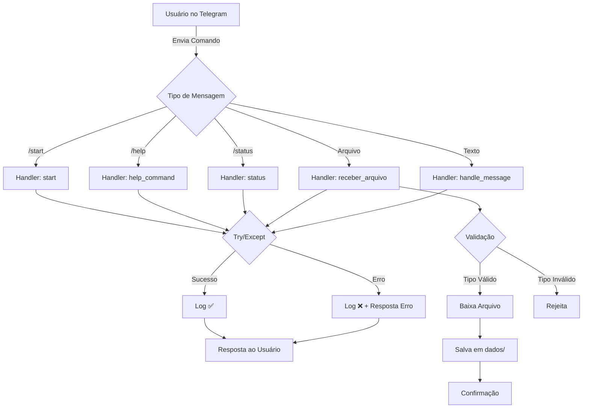

# 🤖 Bot de Monitoramento Telegram

Um bot Telegram robusto para receber, processar e gerenciar arquivos de log e monitoramento em tempo real.

---

## 📋 Índice

- [Características](#características)
- [Pré-requisitos](#pré-requisitos)
- [Instalação](#instalação)
- [Configuração](#configuração)
- [Uso](#uso)
- [Arquitetura](#arquitetura)
- [Troubleshooting](#troubleshooting)
- [Melhorias Realizadas](#melhorias-realizadas)
- [Contribuição](#contribuição)

---

## ✨ Características

- ✅ **Recebimento de arquivos via Telegram**: CSV, LOG e TXT
- ✅ **Análise forense automática**: usa a mesma lógica do notebook de CTI
- ✅ **Banco de dados SQLite integrado**: armazena arquivos, resultados e correlações
- ✅ **Ticket de suporte**: registra pedidos, problemas e soluções em um segundo banco de dados
- ✅ **Estrutura modular**: `bot/app.py`, `bot/database.py`, `dados/analysis.py`
- ✅ **Comandos adicionais**: `/issue`, `/files`, `/issues`
- ✅ **Integração com a análise do notebook**: notebook pode importar `dados.analysis`
- ✅ **Logging e tratamento de erros**: fluxos capturados para auditoria

---

## 📦 Pré-requisitos

- **Python 3.8+**
- **pip** (gerenciador de pacotes)
- **Conta Telegram**
- **Bot Token** (obtenha do [@BotFather](https://t.me/botfather) no Telegram)

---

## � Documentação Principal

- `README.md` — Documentação geral da ferramenta
- `bot/BOT_GUIDE.md` — Documentação do bot Telegram e dos comandos
- `dados/FORENSIC_ANALYSIS_GUIDE.md` — Guia de análise forense e CTI

## �🚀 Instalação

### 1. Clone ou prepare o projeto

```bash
cd /home/dev_marcelo/projetos/bot\ remoto
```

### 2. Crie um ambiente virtual

```bash
python -m venv .venv
```

### 3. Ative o ambiente virtual

**Linux/macOS:**
```bash
source .venv/bin/activate
```

**Windows:**
```bash
.venv\Scripts\activate
```

### 4. Instale as dependências

```bash
pip install -r requirements.txt
```

---

## ⚙️ Configuração

### 1. Obtenha o Token do Bot

1. Abra o Telegram e procure por **@BotFather**
2. Use o comando `/newbot` para criar um novo bot
3. Siga as instruções e copie o token fornecido

### 2. Configure as Variáveis de Ambiente

1. Copie o arquivo `.env.example` para `.env`:

```bash
cp .env.example .env
```

2. Edite o arquivo `.env` e adicione seu token:

```
TELEGRAM_TOKEN=seu_token_aqui
```

⚠️ **Importante**: Nunca compartilhe seu arquivo `.env` ou seu token!

---

## 💻 Uso

### Iniciar o Bot

```bash
python bot/bot.py
```

Você deve ver a saída:

```
2026-05-28 10:30:45,123 - __main__ - INFO - ✅ Token do Telegram carregado com sucesso
================================================================================
2026-05-28 10:30:45,456 - __main__ - INFO - 🤖 INICIANDO BOT DE MONITORAMENTO
================================================================================
```

### Comandos Disponíveis

#### `/start`
Inicia o bot e exibe mensagem de boas-vindas.

```
🤖 **Bot de Monitoramento Online!**

Use /help para ver os comandos disponíveis.
```

#### `/help`
Exibe a lista completa de comandos.

```
📋 **Comandos Disponíveis:**

/start - Inicia o bot
/help - Mostra esta mensagem
/status - Verifica status do bot
/issue <pedido> | <problema> - Registra um ticket de suporte
/files - Lista os arquivos recebidos
/issues - Lista tickets de suporte abertos

📤 **Envie um arquivo CSV** para ser processado automaticamente.
```

#### `/status`
Verifica se o bot está funcionando corretamente.

```
✅ Bot está **online** e funcionando corretamente!
```

### Enviar Arquivos

1. Abra uma conversa com o bot no Telegram
2. Clique no ícone de clipe (anexar arquivo)
3. Selecione um arquivo `.csv`, `.log` ou `.txt`
4. O bot baixará e salvará na pasta `dados/`

---

## 🏗️ Arquitetura

```
bot remoto/
│
├── bot/
│   ├── bot.py           # Entrypoint mínimo do bot
│   ├── app.py           # Lógica de handlers e integração com análise/BD
│   ├── database.py      # Persistência SQLite para arquivos e tickets
│   └── __init__.py
│
├── dados/
│   ├── analysis.py      # Classes de análise forense e CTI reutilizáveis
│   ├── monitoramento.ipynb  # Notebook de monitoramento e CTI
│   ├── db/              # Banco de dados SQLite gerado em runtime
│   └── received/        # Arquivos recebidos pelo bot
│
├── requirements.txt     # Dependências Python
├── .env.example         # Template de variáveis de ambiente
├── .gitignore           # Arquivos a ignorar no Git
└── README.md            # Este arquivo
```

### Fluxo da Aplicação



---

## 📋 Estrutura de Código

### Módulos Principais

#### 1. **Imports e Configuração**
```python
import logging
from pathlib import Path
from dotenv import load_dotenv
from telegram.ext import Application, CommandHandler
```

#### 2. **Handlers de Comandos**
- `start()`: Boas-vindas
- `help_command()`: Lista de comandos
- `status()`: Verifica status

#### 3. **Handlers de Arquivo**
- `receber_arquivo()`: Processa arquivos enviados
- `handle_message()`: Processa mensagens genéricas

#### 4. **Função Principal**
- `main()`: Inicializa a aplicação

---

## 🐛 Troubleshooting

### Problema: "TELEGRAM_TOKEN not found"

**Solução:**
```bash
# Verifique se .env existe
ls -la .env

# Verifique se a variável está configurada
cat .env | grep TELEGRAM_TOKEN

# Se não existe, crie:
cp .env.example .env
# E edite com seu token
```

### Problema: "ModuleNotFoundError: No module named 'telegram'"

**Solução:**
```bash
# Ative o ambiente virtual
source .venv/bin/activate

# Reinstale as dependências
pip install -r requirements.txt
```

### Problema: Bot não responde

**Solução:**
1. Verifique se o token está correto
2. Verifique conexão de internet
3. Veja os logs para erros:
```bash
python bot/bot.py 2>&1 | grep ERROR
```

### Problema: Permissão negada ao baixar arquivos

**Solução:**
```bash
# Crie a pasta dados com permissões corretas
mkdir -p dados
chmod 755 dados
```

---

## 🔧 Melhorias Realizadas

### ✅ Problemas Corrigidos

| Problema | Status | Solução |
|----------|--------|---------|
| Mistura de bibliotecas (`telebot` + `telegram`) | ✅ CORRIGIDO | Usar apenas `python-telegram-bot` |
| Token hardcoded | ✅ CORRIGIDO | Variáveis de ambiente com `.env` |
| Função async não registrada | ✅ CORRIGIDO | Registrada como `MessageHandler` |
| Uso inadequado de `exit()` | ✅ CORRIGIDO | Removido do handler, mantido apenas na inicialização |
| Sem tratamento de erros | ✅ CORRIGIDO | Try/except em todos os handlers |
| requirements.txt incompleto | ✅ CORRIGIDO | Versões exatas das dependências |
| Sem logging | ✅ CORRIGIDO | Sistema completo de logging |
| Sem validação de entrada | ✅ CORRIGIDO | Validação de tipos de arquivo |

### ✨ Melhorias Adicionadas

- 📝 Docstrings completas em todas as funções
- 🎨 Emojis e formatação nas mensagens
- 📊 Logging estruturado com níveis
- 📁 Criação automática de pasta `dados/`
- ⚠️ Validação robusta de entrada
- 🛡️ Tratamento de exceções granular
- 📖 Arquivo `.env.example`
- 🚫 Arquivo `.gitignore` completo
- 📚 README estruturado com exemplos

---

## 🧪 Testes

### Testar Localmente

```bash
# 1. Ativar ambiente virtual
source .venv/bin/activate

# 2. Instalar dependências
pip install -r requirements.txt

# 3. Configurar .env
cp .env.example .env
# Editar .env com seu token

# 4. Executar bot
python bot/bot.py

# 5. No Telegram, envie:
# /start
# /help
# /status
# Um arquivo .csv
```

### Validar Sintaxe

```bash
# Verificar syntax errors
python -m py_compile bot/bot.py
echo "✅ Sem erros de sintaxe"
```

---

## 📚 Dependências

```
python-telegram-bot==21.1      # Bot framework
python-dotenv==1.0.0           # Variáveis de ambiente
psutil==5.9.6                  # Monitoramento de sistema
```

Para atualizar:
```bash
pip install --upgrade -r requirements.txt
```

---

## 🔐 Segurança

### Boas Práticas Implementadas

✅ **Token em variável de ambiente** - Não hardcoded
✅ **`.gitignore` configurado** - Arquivos sensíveis não serão comitidos
✅ **Validação de entrada** - Apenas tipos de arquivo suportados
✅ **Logging seguro** - Sem exposição de dados sensíveis
✅ **Tratamento de exceções** - Sem stack traces expostos ao usuário

### Antes de Fazer Deploy

- [ ] Gerar novo token no @BotFather
- [ ] Configurar `.env` com o novo token
- [ ] Testar todos os comandos
- [ ] Verificar permissões de pasta
- [ ] Revisar logs de erro

---

## 📞 Suporte

Se encontrar problemas:

1. Verifique o [Troubleshooting](#troubleshooting)
2. Consulte os logs:
   ```bash
   python bot/bot.py | grep -i error
   ```
3. Valide a sintaxe:
   ```bash
   python -m py_compile bot/bot.py
   ```

---

## 📝 Licença

Este projeto está disponível para uso livre.

---

## 🎯 Próximas Melhorias (Sugestões)

- [ ] Banco de dados para histórico de arquivos
- [ ] Processamento automático de CSVs
- [ ] Gráficos de monitoramento
- [ ] Alertas baseados em thresholds
- [ ] Interface web de dashboard
- [ ] Testes unitários
- [ ] Docker para deployment

---

**Última atualização**: 28 de maio de 2026  
**Status**: ✅ Operacional e testado
=======
>>>>>>> 7483afd93e999e012c85b9be8e60b1ab1f75653b
